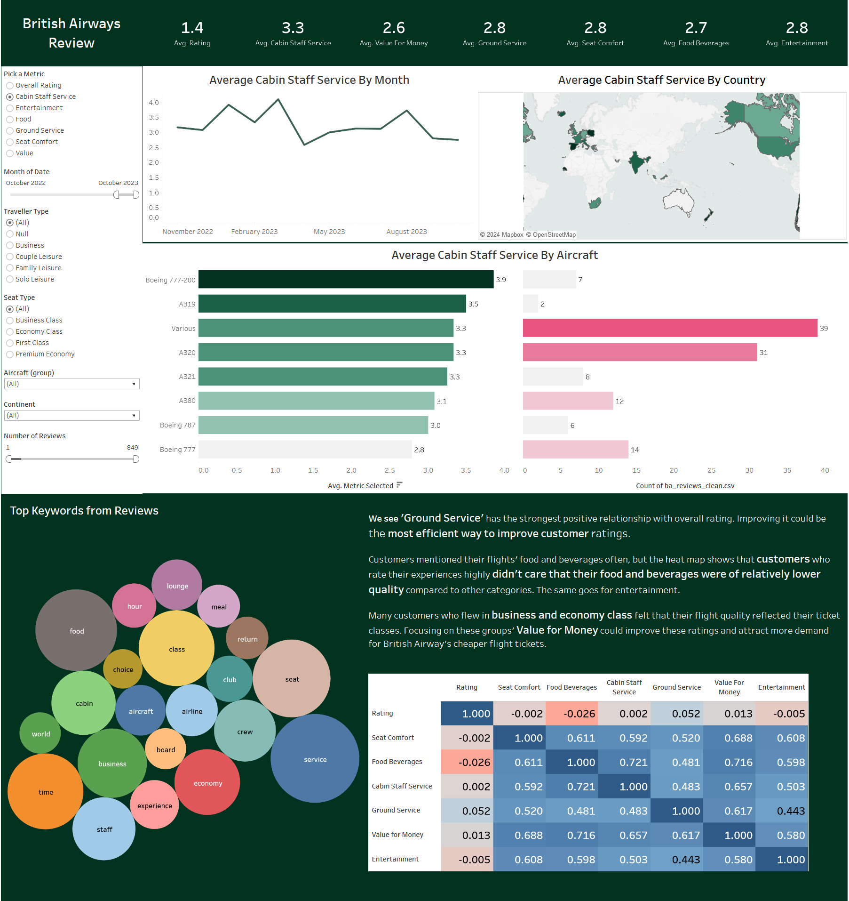

# British Airway Reviews Analysis

Analyzing customer reviews for British Airway's flight experiences from 2016-2023. Tableau dashboard can be found [here](https://public.tableau.com/app/profile/minjoo.kim6286/viz/BritishAirwayReviews_17136461040290/Dashboard1).

## Summary of Insights

* Customers care the most about Ground Service in their flights, followed by Value for Money. It seems there's a certain margin of error allowed for the other factors of the experience that British Airway exceeds.

* Customers cared least about the quality of their in-flight food, beverages, and entertainment, despite the frequency at which they mentioned them. As flights that provide these are a fraction of all flights, we can prioritize improving the other factors.

* Customers in business and economy class seats mentioned it often in their mostly negative reviews, implying their class-specific flight experiences were big factors in their ratings.

* The planes used oscillate frequently from high ratings to low and vice versa, often in a pattern where one factor will have ratings soar at the same month another plummets. This happens across all the planes used.

## Recommendations & Next Steps

* Investigate the differences between the recently high-rated flight attributes and the recently low-rated flight attributes for their causes. Did the planes get maintenance done recently, or suffer from wear and tear? Were there any delays or luggage mishandling that prompted any compensations that account for the wildly different ratings?

* Investigate the competitors' plane services and flight experiences, particularly their business and economy class experiences and ground services. Did customers' standards increase over time? Is British Airway underperforming compared to its competitors?

## Requirements

* Jupyter Notebook
* Python
* [Kaggle's British Airway dataset](https://www.kaggle.com/datasets/lapodini/british-airway-reviews)
